# devops-b11-m7-monitoring
Backend deployment on AWS EC2 with database, CI/CD using GitHub Actions, and observability using Prometheus, Grafana, and Node Exporter


# Module 7 Assignment Documentation

## Backend Deployment, Database Deployment, CI/CD, and Prometheus Monitoring on AWS EC2

## Introduction

For my Module 7 assignment, I deployed a backend application with a MySQL database on AWS EC2. I also automated the backend deployment using GitHub Actions and started implementing a basic observability stack using Node Exporter and Prometheus.

In this assignment, I used two EC2 instances:

```text
engr-backend-ec2
engr-monitoring-ec2
```

The backend EC2 is used for the backend application, MySQL database, Gunicorn, Nginx, and Node Exporter.

The monitoring EC2 is used for Prometheus monitoring.

At this stage, I completed the deployment up to Prometheus. Grafana dashboard setup and SMTP-based email alerting can be added later as the next part of the assignment.

---

# Assignment Requirement

The assignment requirement was:

```text
Deploy a backend application with a database on AWS EC2 and automate deployment using GitHub Actions.
Implement a minimalist observability stack using Prometheus, Grafana, and Node Exporter to monitor CPU, RAM, disk, and network usage.
Configure SMTP-based email alerts for critical system issues as a bonus feature.
All configurations, CI/CD workflows, and deployment files must be maintained in a GitHub repository.
```

---

# Overall Architecture

My current architecture is:

```text
GitHub Repository
      |
      | GitHub Actions CI/CD
      v
engr-backend-ec2
      |
      | Backend Application
      | MySQL Database
      | Gunicorn
      | Nginx
      | Node Exporter
      v
engr-monitoring-ec2
      |
      | Prometheus
      v
Metrics Collection
```

The backend application runs on `engr-backend-ec2`. MySQL is also installed on the same server and is accessed locally by the backend application.

Node Exporter is installed on the backend server to expose system metrics such as CPU, RAM, disk, and network usage.

Prometheus is installed on `engr-monitoring-ec2` and scrapes metrics from Node Exporter.

---

# Server Information

## Backend EC2

```text
EC2 Name: engr-backend-ec2
Operating System: Ubuntu Server 24.04 LTS
Backend Public IP: 13.212.210.63
Backend Directory: /home/ubuntu/backend
Backend Port: 8000
Public Web Port: 80
Database: MySQL
Database Port: 3306
Node Exporter Port: 9100
```

## Monitoring EC2

```text
EC2 Name: engr-monitoring-ec2
Operating System: Ubuntu Server 24.04 LTS
Prometheus Port: 9090
Monitoring Public IP: 13.251.156.253
```

---

# Security Group Configuration

## Backend EC2 Security Group

For the backend EC2, I allowed only the required ports.

```text
SSH          22     My IP
HTTP         80     Anywhere IPv4
Custom TCP   9100   Monitoring EC2 Security Group
```

I did not open MySQL port `3306` publicly because MySQL is running on the same EC2 as the backend application.

I also did not need to expose backend port `8000` publicly after configuring Nginx. Nginx receives public traffic on port `80` and forwards requests to Gunicorn running locally on `127.0.0.1:8000`.

## Monitoring EC2 Security Group

For the monitoring EC2, I allowed:

```text
SSH          22     My IP
Custom TCP   9090   My IP
```

Port `9090` is used to access Prometheus.

---

# Part 1: Backend Deployment

## 1. Update and Upgrade the Server

First, I connected to my backend EC2 instance using SSH. Then I updated and upgraded the Ubuntu packages.

```bash
sudo apt update
sudo apt upgrade -y
```

---

## 2. Install Required Packages

Then I installed the required packages for Python, Git, build tools, and MySQL dependency support.

```bash
sudo apt install -y \
git curl wget unzip make build-essential gcc \
libssl-dev zlib1g-dev libbz2-dev libreadline-dev \
libsqlite3-dev llvm libncursesw5-dev xz-utils tk-dev \
libxml2-dev libxmlsec1-dev libffi-dev liblzma-dev \
python3-dev python3-venv python3-distutils-extra \
pkg-config default-libmysqlclient-dev mysql-client
```

---

## 3. Install pyenv

I installed `pyenv` to manage the Python version.

```bash
curl https://pyenv.run | bash
```

Then I added `pyenv` to the shell configuration.

```bash
echo 'export PYENV_ROOT="$HOME/.pyenv"' >> ~/.bashrc
echo 'export PATH="$PYENV_ROOT/bin:$PATH"' >> ~/.bashrc
echo 'eval "$(pyenv init --path)"' >> ~/.bashrc
echo 'eval "$(pyenv init -)"' >> ~/.bashrc
source ~/.bashrc
```

I also loaded `pyenv` for the current session.

```bash
export PYENV_ROOT="$HOME/.pyenv"
export PATH="$PYENV_ROOT/bin:$PATH"
eval "$(pyenv init --path)"
eval "$(pyenv init -)"
pyenv --version
```

---

## 4. Install Python 3.10.6

I installed Python `3.10.6` using `pyenv`.

```bash
pyenv install 3.10.6
```

---

## 5. Clone the Project Repository

After that, I cloned my GitHub repository.

```bash
git clone https://github.com/shefat-global/devops-b11-m7-monitoring.git
```

---

## 6. Move the Backend Folder

I moved the backend folder to `/home/ubuntu/backend`.

```bash
sudo mv /home/ubuntu/devops-b11-m7-monitoring/backend /home/ubuntu/
sudo rm -rf /home/ubuntu/devops-b11-m7-monitoring
```

Then I went inside the backend directory.

```bash
cd /home/ubuntu/backend
```

---

## 7. Set the Local Python Version

Inside the backend folder, I set Python `3.10.6` as the local Python version.

```bash
pyenv local 3.10.6
python --version
```

---

## 8. Create and Activate Virtual Environment

I created a virtual environment inside the backend project.

```bash
python -m venv venv
source venv/bin/activate
```

---

## 9. Install Python Dependencies

I upgraded `pip`, `setuptools`, and `wheel`.

```bash
pip install --upgrade pip setuptools wheel
```

Then I installed Gunicorn.

```bash
pip install gunicorn
```

After that, I installed the project dependencies from `requirements.txt`.

```bash
pip install -r requirements.txt
```

---

# Part 2: MySQL Database Deployment

## 10. Install MySQL Server

Since the database also needs to run on the same backend EC2, I installed MySQL server and client.

```bash
sudo apt update
sudo apt install mysql-server mysql-client -y
```

---

## 11. Check MySQL Version

I checked the installed MySQL version.

```bash
mysql --version
```

---

## 12. Start and Enable MySQL

I started the MySQL service and enabled it so it starts automatically after reboot.

```bash
sudo systemctl status mysql
sudo systemctl start mysql
sudo systemctl enable mysql
```

---

## 13. Configure MySQL Bind Address

I opened the MySQL configuration file.

```bash
sudo nano /etc/mysql/mysql.conf.d/mysqld.cnf
```

I kept the bind address as:

```ini
bind-address = 127.0.0.1
```

I did not use:

```ini
bind-address = 0.0.0.0
```

because I do not want MySQL to accept remote public connections. My backend and MySQL are on the same EC2, so local access is enough.

Then I restarted MySQL.

```bash
sudo systemctl restart mysql
sudo systemctl status mysql
```

---

## 14. Login to MySQL

I logged in to MySQL as root.

```bash
sudo mysql
```

---

## 15. Create Database and User

I created a database for the backend project.

```sql
CREATE DATABASE portfolio_cms CHARACTER SET utf8mb4 COLLATE utf8mb4_unicode_ci;
```

Then I created a database user for local access only.

```sql
CREATE USER 'portfolio_user'@'localhost' IDENTIFIED BY 'YOUR_DATABASE_PASSWORD';
```

After that, I granted permission to the user.

```sql
GRANT ALL PRIVILEGES ON portfolio_cms.* TO 'portfolio_user'@'localhost';
FLUSH PRIVILEGES;
EXIT;
```

Here, `localhost` means the backend application and MySQL database are running on the same EC2 instance.

---

## 16. Import Existing Database Backup

I imported my SQL backup file into the database.

```bash
sudo mysql portfolio_cms < /home/ubuntu/portfolio_cms.sql
```

---

## 17. Verify Database Tables

I logged in to MySQL again and checked the database tables.

```bash
sudo mysql
```

Then I ran:

```sql
USE portfolio_cms;
SHOW TABLES;
EXIT;
```

This confirmed that the database import was successful.

---

## 18. Test Database User Login

I tested the database user login.

```bash
mysql -u portfolio_user -p portfolio_cms
```

I also tested it using the local host address.

```bash
mysql -h 127.0.0.1 -u portfolio_user -p portfolio_cms
```

After entering the password, I was able to connect to the database successfully.

---

# Part 3: Backend and Database Connection

## 19. Configure Backend Environment Variables

I configured the backend `.env` file to connect with the local MySQL database.

```env
DB_NAME=portfolio_cms
DB_USER=portfolio_user
DB_PASSWORD=YOUR_DATABASE_PASSWORD
DB_HOST=127.0.0.1
DB_PORT=3306
```

Since MySQL is installed on the same EC2 as the backend application, I used:

```text
DB_HOST=127.0.0.1
```

---

## 20. Run Django Migrations

After connecting the backend with MySQL, I ran the Django migrations.

```bash
python manage.py makemigrations
python manage.py migrate
```

---

## 21. Create Django Superuser

I created a Django admin superuser.

```bash
python manage.py createsuperuser
```

---

## 22. Collect Static Files

I collected static files for production use.

```bash
python manage.py collectstatic
```

---

## 23. Test Backend with Gunicorn

I tested the backend application with Gunicorn.

```bash
gunicorn --bind 0.0.0.0:8000 config.wsgi:application
```

If the project WSGI name is different, I need to replace `config.wsgi:application` with the correct project WSGI path.

---

# Part 4: Gunicorn Service Setup

## 24. Create Gunicorn Systemd Service

To keep the backend running permanently, I created a systemd service.

```bash
sudo nano /etc/systemd/system/wagtail.service
```

I added the following service configuration:

```ini
[Unit]
Description=Gunicorn service for Wagtail Django backend
After=network.target

[Service]
User=ubuntu
Group=www-data
WorkingDirectory=/home/ubuntu/backend
Environment="PATH=/home/ubuntu/backend/venv/bin"
ExecStart=/home/ubuntu/backend/venv/bin/gunicorn config.wsgi:application --workers 3 --bind 127.0.0.1:8000

Restart=always
RestartSec=5

[Install]
WantedBy=multi-user.target
```

Then I enabled and started the service.

```bash
sudo systemctl daemon-reload
sudo systemctl enable wagtail
sudo systemctl start wagtail
sudo systemctl status wagtail
```

At this point, the backend application was running with Gunicorn on local port `8000`.

---

# Part 5: Nginx Reverse Proxy Deployment

## 25. Why I Used Nginx

My backend application was running with Gunicorn on port `8000`. To make the application accessible through the normal HTTP port, I installed and configured Nginx as a reverse proxy.

The purpose of using Nginx was to receive public traffic on port `80` and forward the requests to the backend application running locally on port `8000`.

This allows users to access the application using:

```text
http://13.212.210.63
```

instead of:

```text
http://13.212.210.63:8000
```

---

## 26. Install Nginx

I installed Nginx on the backend EC2 instance.

```bash
sudo apt update
sudo apt install -y nginx
```

After installing Nginx, I enabled and started the Nginx service.

```bash
sudo systemctl enable nginx
sudo systemctl start nginx
```

Then I checked the Nginx service status.

```bash
sudo systemctl status nginx
```

At this point, Nginx was successfully installed and running on the backend EC2 instance.

---

## 27. Create Nginx Configuration File

Next, I created a custom Nginx configuration file for my backend application.

```bash
sudo nano /etc/nginx/sites-available/backend
```

Inside this file, I added the following Nginx server configuration.

```nginx
server {
    listen 80;
    server_name 13.212.210.63;

    client_max_body_size 50M;

    location /static/ {
        alias /home/ubuntu/backend/static/;
        access_log off;
        expires 30d;
    }

    location /media/ {
        alias /home/ubuntu/backend/media/;
        access_log off;
        expires 30d;
    }

    location /api/ {
        proxy_pass http://127.0.0.1:8000;
        proxy_set_header Host $host;
        proxy_set_header X-Real-IP $remote_addr;
        proxy_set_header X-Forwarded-For $proxy_add_x_forwarded_for;
        proxy_set_header X-Forwarded-Proto $scheme;
    }

    location /admin/ {
        proxy_pass http://127.0.0.1:8000;
        proxy_set_header Host $host;
        proxy_set_header X-Real-IP $remote_addr;
        proxy_set_header X-Forwarded-For $proxy_add_x_forwarded_for;
        proxy_set_header X-Forwarded-Proto $scheme;
    }

    location / {
        proxy_pass http://127.0.0.1:8000;
        proxy_set_header Host $host;
        proxy_set_header X-Real-IP $remote_addr;
        proxy_set_header X-Forwarded-For $proxy_add_x_forwarded_for;
        proxy_set_header X-Forwarded-Proto $scheme;
    }
}
```

In this configuration, Nginx listens on port `80` and forwards backend requests to Gunicorn running on `127.0.0.1:8000`.

I also configured Nginx to serve static files directly from:

```text
/home/ubuntu/backend/static/
```

and media files from:

```text
/home/ubuntu/backend/media/
```

---

## 28. Enable the Nginx Site

After creating the configuration file, I removed the default Nginx site.

```bash
sudo rm -f /etc/nginx/sites-enabled/default
```

Then I enabled my custom backend configuration by creating a symbolic link.

```bash
sudo ln -sf /etc/nginx/sites-available/backend /etc/nginx/sites-enabled/backend
```

---

## 29. Test and Restart Nginx

Before restarting Nginx, I tested the configuration to make sure there were no syntax errors.

```bash
sudo nginx -t
```

After the test was successful, I restarted Nginx.

```bash
sudo systemctl restart nginx
```

Then I checked the Nginx service again.

```bash
sudo systemctl status nginx
```

---

## 30. Static File Issue and Fix

After configuring Nginx, my backend application was loading, but the style was broken. This happened because the static files were not being served correctly at first.

I verified that the static files existed inside the backend project directory.

```bash
ls -la /home/ubuntu/backend/static
ls -la /home/ubuntu/backend/static/admin/css/
```

Then I tested one static CSS file from my local machine using `curl`.

```bash
curl -I http://13.212.210.63/static/admin/css/base.css
```

The response returned:

```text
HTTP/1.1 200 OK
Content-Type: text/css
```

This confirmed that Nginx was able to serve the static file. After checking, I found that the issue was related to file permissions. I fixed the permission issue and restarted Nginx.

```bash
sudo chmod 755 /home
sudo chmod 755 /home/ubuntu
sudo chmod 755 /home/ubuntu/backend
sudo chmod -R 755 /home/ubuntu/backend/static
sudo systemctl restart nginx
```

After this, the Django/Wagtail admin panel loaded correctly with proper styling.

---

## 31. Final Nginx Testing

Finally, I tested the backend application through the browser using the public IP without port `8000`.

```text
http://13.212.210.63/admin/
```

The application loaded successfully through Nginx on port `80`.

---

# Part 6: CI/CD Backend Deployment Using GitHub Actions

## 32. Why I Used GitHub Actions

For this part of the assignment, I configured a CI/CD pipeline for my backend application using GitHub Actions.

The main goal of this CI/CD setup was to make backend deployment easier and more automated. Instead of manually copying files and restarting services every time I make changes, I can now trigger a GitHub Actions workflow and deploy the latest backend code to my EC2 server.

---

## 33. GitHub Repository Structure

My GitHub repository for this assignment is:

```text
https://github.com/shefat-global/devops-b11-m7-monitoring
```

Inside the repository, the backend code is stored inside the `backend` folder.

```text
devops-b11-m7-monitoring/
├── backend/
├── .github/
│   └── workflows/
│       └── backend-deploy.yml
└── README.md
```

Since my live backend is already running from `/home/ubuntu/backend`, I designed the CI/CD workflow so that it does not change my existing server structure. The workflow uploads the latest backend code from GitHub and syncs it safely with the live backend directory.

---

## 34. GitHub Secrets Configuration

To connect GitHub Actions with my EC2 server securely, I added the required values as GitHub repository secrets.

I went to:

```text
GitHub Repository → Settings → Secrets and variables → Actions → New repository secret
```

Then I added these secrets:

```text
EC2_HOST = 13.212.210.63
EC2_USER = ubuntu
EC2_PORT = 22
EC2_SSH_KEY = Private SSH key content
```

I did not upload my `.pem` file directly to the repository. Instead, I copied the private key content into GitHub Secrets. This keeps the SSH key hidden and secure.

---

## 35. GitHub Actions Workflow

I created the workflow file at:

```text
.github/workflows/backend-deploy.yml
```

The workflow is manually triggered using `workflow_dispatch`. I used a manual trigger because I wanted full control over when the deployment runs. This means the backend will not deploy automatically on every push. I can go to the GitHub Actions tab and run the deployment only when I want.

The workflow file is:

```yaml
name: Deploy Backend to EC2

on:
  workflow_dispatch:

jobs:
  deploy:
    runs-on: ubuntu-latest

    steps:
      - name: Checkout repository
        uses: actions/checkout@v4

      - name: Prepare remote deploy folder
        uses: appleboy/ssh-action@v1
        with:
          host: ${{ secrets.EC2_HOST }}
          username: ${{ secrets.EC2_USER }}
          key: ${{ secrets.EC2_SSH_KEY }}
          port: ${{ secrets.EC2_PORT }}
          script: |
            rm -rf /tmp/backend-deploy
            mkdir -p /tmp/backend-deploy

      - name: Upload backend folder to EC2
        uses: appleboy/scp-action@v1
        with:
          host: ${{ secrets.EC2_HOST }}
          username: ${{ secrets.EC2_USER }}
          key: ${{ secrets.EC2_SSH_KEY }}
          port: ${{ secrets.EC2_PORT }}
          source: "backend"
          target: "/tmp/backend-deploy"

      - name: Deploy backend on EC2
        uses: appleboy/ssh-action@v1
        with:
          host: ${{ secrets.EC2_HOST }}
          username: ${{ secrets.EC2_USER }}
          key: ${{ secrets.EC2_SSH_KEY }}
          port: ${{ secrets.EC2_PORT }}
          script: |
            set -e

            LIVE_BACKEND="/home/ubuntu/backend"
            RELEASE_BACKEND="/tmp/backend-deploy/backend"

            echo "Syncing backend code..."
            rsync -av --delete \
              --exclude "venv/" \
              --exclude ".env" \
              --exclude "media/" \
              --exclude "static/" \
              --exclude "__pycache__/" \
              --exclude "*.pyc" \
              "$RELEASE_BACKEND/" "$LIVE_BACKEND/"

            echo "Activating virtual environment..."
            cd "$LIVE_BACKEND"
            source "$LIVE_BACKEND/venv/bin/activate"

            echo "Installing dependencies..."
            pip install -r requirements.txt

            echo "Running migrations..."
            python manage.py migrate --noinput

            echo "Collecting static files..."
            python manage.py collectstatic --noinput

            echo "Restarting backend service..."
            sudo systemctl restart wagtail

            echo "Restarting nginx..."
            sudo systemctl restart nginx

            echo "Checking service..."
            sudo systemctl status wagtail --no-pager

            echo "Deployment successful."
```

---

## 36. How the Workflow Works

First, GitHub Actions checks out my repository using:

```yaml
uses: actions/checkout@v4
```

This downloads the repository into the GitHub Actions runner.

Then I use `appleboy/ssh-action` to connect to my EC2 server and prepare a temporary deployment folder:

```text
/tmp/backend-deploy
```

After that, I use `appleboy/scp-action` to copy the `backend` folder from my GitHub repository to the EC2 server.

The copied backend folder goes to:

```text
/tmp/backend-deploy/backend
```

Then the workflow connects to the EC2 server again using `appleboy/ssh-action` and syncs the uploaded backend code into the live backend directory:

```text
/home/ubuntu/backend
```

I used `rsync` with exclude rules so that important server files are not deleted or overwritten.

The excluded files and folders are:

```text
venv/
.env
media/
static/
__pycache__/
*.pyc
```

This is important because:

```text
venv/ contains the Python virtual environment
.env contains secret environment variables
media/ contains uploaded media files
static/ contains collected static files
```

So the workflow updates my backend code but keeps my environment, secrets, static files, and media files safe.

---

## 37. Server Commands Run During Deployment

During deployment, the workflow runs these commands on the EC2 server:

```bash
cd /home/ubuntu/backend
source /home/ubuntu/backend/venv/bin/activate
pip install -r requirements.txt
python manage.py migrate --noinput
python manage.py collectstatic --noinput
sudo systemctl restart wagtail
sudo systemctl restart nginx
sudo systemctl status wagtail --no-pager
```

The `migrate` command applies any new database migrations.

The `collectstatic --noinput` command collects static files without asking for manual confirmation. This is useful for CI/CD because GitHub Actions cannot type `yes` interactively.

Finally, the workflow restarts the backend Gunicorn service and Nginx.

---

## 38. Sudo Permission for GitHub Actions

Because GitHub Actions needs to restart system services, I allowed the `ubuntu` user to run specific `systemctl` commands without a password.

I edited the sudoers file using:

```bash
sudo visudo
```

Then I added:

```text
ubuntu ALL=(ALL) NOPASSWD: /bin/systemctl restart wagtail, /bin/systemctl restart nginx, /bin/systemctl status wagtail
```

This allows GitHub Actions to restart only the required services without exposing full password-based access.

---

## 39. Security Group Issue and Fix

At first, the GitHub Actions workflow failed with an SSH timeout error:

```text
dial tcp ***:***: i/o timeout
```

This happened because my EC2 security group allowed SSH only from my own IP address. GitHub Actions runs from GitHub-hosted runner IP addresses, so it could not connect to my EC2 server.

To fix this during testing, I temporarily allowed SSH from anywhere:

```text
Type: SSH
Port: 22
Source: 0.0.0.0/0
```

After the workflow successfully connected and deployed the backend, I understood that the issue was not with the SSH key. The issue was the security group blocking GitHub Actions.

For better security, SSH access should be restricted again after testing or replaced with a safer production method such as a self-hosted runner or AWS SSM.

---

## 40. CI/CD Verification

After running the workflow, I verified the deployment by checking the GitHub Actions logs. The workflow completed successfully.

I also checked the backend service status on the EC2 server:

```bash
sudo systemctl status wagtail
```

I checked Nginx status:

```bash
sudo systemctl status nginx
```

Finally, I opened the backend in the browser:

```text
http://13.212.210.63
```

The backend loaded successfully, which confirmed that the CI/CD pipeline was working.

---

# Part 7: Node Exporter Deployment on Backend EC2

## 41. Why I Installed Node Exporter

As part of my observability setup, I installed and configured Node Exporter on my backend EC2 instance named `engr-backend-ec2`.

The purpose of installing Node Exporter was to expose system-level metrics from the backend server so that Prometheus can scrape and monitor the server.

These metrics include:

```text
CPU usage
Memory usage
Disk usage
Network traffic
System load
Target availability
```

Since the backend application and MySQL database are running on `engr-backend-ec2`, this server is important to monitor.

---

## 42. Download Node Exporter

First, I connected to my backend EC2 instance using SSH. Then I moved to the `/tmp` directory and downloaded the Node Exporter package.

```bash
cd /tmp

wget https://github.com/prometheus/node_exporter/releases/download/v1.11.1/node_exporter-1.11.1.linux-amd64.tar.gz
```

---

## 43. Extract Node Exporter

After downloading the package, I extracted the tar file.

```bash
tar xvf node_exporter-1.11.1.linux-amd64.tar.gz
```

---

## 44. Move Node Exporter Binary

Then I moved the Node Exporter binary file to `/usr/local/bin/` so that it can be executed system-wide.

```bash
sudo mv node_exporter-1.11.1.linux-amd64/node_exporter /usr/local/bin/
```

After that, I checked the installed version.

```bash
node_exporter --version
```

---

## 45. Create Node Exporter User

To run Node Exporter securely, I created a separate system user named `node_exporter`.

```bash
sudo useradd --no-create-home --shell /bin/false node_exporter
```

At first, my Node Exporter service failed because the `node_exporter` user did not exist. The error was:

```text
status=217/USER
Failed to determine user credentials
```

After creating the `node_exporter` user, the service issue was fixed.

---

## 46. Create Node Exporter Systemd Service

Next, I created a systemd service file so that Node Exporter can run automatically as a background service.

```bash
sudo nano /etc/systemd/system/node_exporter.service
```

I added the following service configuration:

```ini
[Unit]
Description=Node Exporter
After=network.target

[Service]
User=node_exporter
Group=node_exporter
Type=simple
ExecStart=/usr/local/bin/node_exporter

[Install]
WantedBy=multi-user.target
```

This service file allows Node Exporter to run as the `node_exporter` user and start automatically after the server boots.

---

## 47. Start and Enable Node Exporter

After creating the service file, I reloaded systemd and started the Node Exporter service.

```bash
sudo systemctl daemon-reload
sudo systemctl enable node_exporter
sudo systemctl start node_exporter
sudo systemctl status node_exporter
```

After fixing the user issue, Node Exporter started successfully.

---

## 48. Test Node Exporter Locally

To verify that Node Exporter was working, I tested it from the backend EC2 instance using `curl`.

```bash
curl http://localhost:9100/metrics
```

The command returned many system metrics, which confirmed that Node Exporter was running correctly.

Some important metrics I found were:

```text
node_cpu_seconds_total
node_memory_MemAvailable_bytes
node_filesystem_avail_bytes
node_network_receive_bytes_total
node_network_transmit_bytes_total
node_exporter_build_info
```

These metrics prove that Node Exporter is exposing CPU, memory, disk, and network information from the backend server.

---

## 49. Node Exporter Security Group Configuration

Since Node Exporter runs on port `9100`, I configured the security group carefully.

On the backend EC2 security group, I allowed port `9100` only from the monitoring EC2 security group. I did not open this port to the public internet.

The inbound rule was:

```text
Type: Custom TCP
Port: 9100
Source: Monitoring EC2 Security Group
```

This allows only the Prometheus server running on `engr-monitoring-ec2` to scrape metrics from the backend server.

---

# Part 8: Prometheus Deployment on Monitoring EC2

## 50. Why I Used Prometheus

As part of my Module 7 assignment, I deployed a monitoring server on AWS EC2 to build a basic observability stack.

I used a separate EC2 instance named `engr-monitoring-ec2` for monitoring. On this server, I installed and configured Prometheus.

Prometheus is used to collect and store metrics. In my setup, Prometheus scrapes metrics from:

```text
Prometheus itself
Node Exporter on engr-backend-ec2
```

This helps me monitor CPU, RAM, disk, network usage, and target availability.

---

## 51. Update the Monitoring Server

First, I connected to my monitoring EC2 instance using SSH. After logging in, I updated and upgraded the server packages.

```bash
sudo apt update && sudo apt upgrade -y
```

This ensured that the server had the latest package updates before installing Prometheus.

---

## 52. Create Prometheus User

I created a dedicated system user for Prometheus so that Prometheus does not run as the root user.

```bash
sudo useradd --no-create-home --shell /bin/false prometheus
```

---

## 53. Create Prometheus Directories

Then I created the required directories for Prometheus configuration and data storage.

```bash
sudo mkdir -p /etc/prometheus
sudo mkdir -p /var/lib/prometheus
```

Here:

```text
/etc/prometheus      → stores Prometheus configuration files
/var/lib/prometheus  → stores Prometheus time-series database data
```

---

## 54. Download Prometheus

After that, I downloaded Prometheus inside the `/tmp` directory.

```bash
cd /tmp

PROM_VERSION="3.11.3"

wget https://github.com/prometheus/prometheus/releases/download/v${PROM_VERSION}/prometheus-${PROM_VERSION}.linux-amd64.tar.gz
```

---

## 55. Extract Prometheus

Then I extracted the Prometheus package.

```bash
tar xvf prometheus-${PROM_VERSION}.linux-amd64.tar.gz
```

I moved into the extracted folder.

```bash
cd prometheus-${PROM_VERSION}.linux-amd64
```

---

## 56. Move Prometheus Binaries

Then I copied the Prometheus binary and `promtool` binary to `/usr/local/bin`.

```bash
sudo cp prometheus /usr/local/bin/
sudo cp promtool /usr/local/bin/
```

---

## 57. Set Prometheus Permissions

After copying the binaries, I changed ownership of the Prometheus files and directories to the `prometheus` user.

```bash
sudo chown -R prometheus:prometheus /etc/prometheus
sudo chown -R prometheus:prometheus /var/lib/prometheus
sudo chown prometheus:prometheus /usr/local/bin/prometheus
sudo chown prometheus:prometheus /usr/local/bin/promtool
```

This gives Prometheus permission to access its configuration, storage, and binary files.

---

## 58. Configure Prometheus

Next, I created the Prometheus configuration file.

```bash
sudo nano /etc/prometheus/prometheus.yml
```

I added the following configuration:

```yaml
global:
  scrape_interval: 15s

scrape_configs:
  - job_name: "prometheus"
    static_configs:
      - targets: ["localhost:9090"]

  - job_name: "backend-node-exporter"
    static_configs:
      - targets: ["13.212.210.63:9100"]
```

In this configuration, `scrape_interval: 15s` means Prometheus collects metrics every 15 seconds.

The first job monitors Prometheus itself:

```text
localhost:9090
```

The second job monitors the backend EC2 server through Node Exporter:

```text
13.212.210.63:9100
```

---

## 59. Create Prometheus Systemd Service

To keep Prometheus running permanently, I created a systemd service file.

```bash
sudo nano /etc/systemd/system/prometheus.service
```

I added the following service configuration:

```ini
[Unit]
Description=Prometheus Monitoring System
Wants=network-online.target
After=network-online.target

[Service]
User=prometheus
Group=prometheus
Type=simple
ExecStart=/usr/local/bin/prometheus \
  --config.file=/etc/prometheus/prometheus.yml \
  --storage.tsdb.path=/var/lib/prometheus \
  --web.listen-address=0.0.0.0:9090

Restart=always

[Install]
WantedBy=multi-user.target
```

This service runs Prometheus using the `prometheus` user and stores metrics data in `/var/lib/prometheus`.

---

## 60. Start and Enable Prometheus

After creating the service file, I reloaded systemd.

```bash
sudo systemctl daemon-reload
```

Then I enabled Prometheus so that it starts automatically after reboot.

```bash
sudo systemctl enable prometheus
```

After that, I started Prometheus.

```bash
sudo systemctl start prometheus
```

Finally, I checked the Prometheus status.

```bash
sudo systemctl status prometheus
```

The service showed:

```text
Active: active (running)
```

This confirmed that Prometheus was running successfully.

---

## 61. Verify Prometheus

After starting Prometheus, I opened it from the browser using:

```text
http://13.251.156.253:9090
```

Then I checked the target health from:

```text
Status → Target health
```

I also tested Prometheus using this query:

```promql
up
```

This query shows whether the configured targets are up or down.

For Node Exporter metrics, I can use queries like:

```promql
node_cpu_seconds_total
node_memory_MemAvailable_bytes
node_filesystem_avail_bytes
node_network_receive_bytes_total
node_network_transmit_bytes_total
```

These metrics help monitor CPU, RAM, disk, and network usage of the backend server.

---

# Current Final Architecture

```text
User Browser
     |
     v
Nginx on engr-backend-ec2 port 80
     |
     v
Gunicorn/Django backend on 127.0.0.1:8000
     |
     v
MySQL database on 127.0.0.1:3306


Prometheus on engr-monitoring-ec2 port 9090
     |
     v
Scrapes Node Exporter on engr-backend-ec2 port 9100
     |
     v
Collects CPU, RAM, disk, and network metrics
```

---

# Current Completed Work

So far, I have completed:

```text
Backend EC2 setup
Backend application deployment
MySQL database deployment
Backend and database connection
Gunicorn service setup
Nginx reverse proxy setup
GitHub Actions CI/CD setup
Node Exporter setup on backend EC2
Prometheus setup on monitoring EC2
Prometheus target verification
```

---

# Remaining Work

The remaining parts of the assignment are:

```text
Grafana dashboard setup
SMTP-based email alerting
Final screenshots and README update
```

Grafana will be used to visualize the Prometheus metrics in dashboards. SMTP alerting can be added as a bonus feature for critical system issues.

---

# Final Summary

In this assignment, I deployed my backend application and MySQL database on an AWS EC2 instance named `engr-backend-ec2`. I configured the backend with Python `3.10.6`, a virtual environment, Gunicorn, and Nginx.

I installed MySQL on the same backend EC2 instance and configured it for local access only using `127.0.0.1`. This keeps the database protected because port `3306` is not exposed publicly.

I also configured a GitHub Actions CI/CD workflow to deploy the backend code to the EC2 server. The workflow uploads the backend folder, syncs it with `/home/ubuntu/backend`, installs dependencies, runs migrations, collects static files, and restarts the backend and Nginx services.

For observability, I installed Node Exporter on the backend EC2 instance. Node Exporter exposes system metrics such as CPU, RAM, disk, and network usage on port `9100`.

Then I installed and configured Prometheus on a separate monitoring EC2 instance named `engr-monitoring-ec2`. Prometheus scrapes metrics from itself and from the backend EC2 Node Exporter target.

This completes my assignment progress up to the Prometheus monitoring setup.


---

# Screenshots

I added the screenshots of my backend deployment, CI/CD workflow, Node Exporter, and Prometheus setup inside the `screenshots` folder of my GitHub repository.

The screenshots show the important steps and verification outputs from my Module 7 assignment.

## Screenshot 1

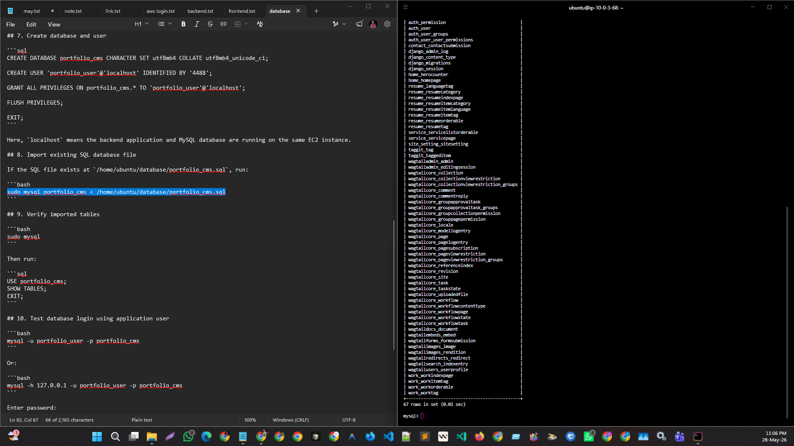

## Screenshot 2

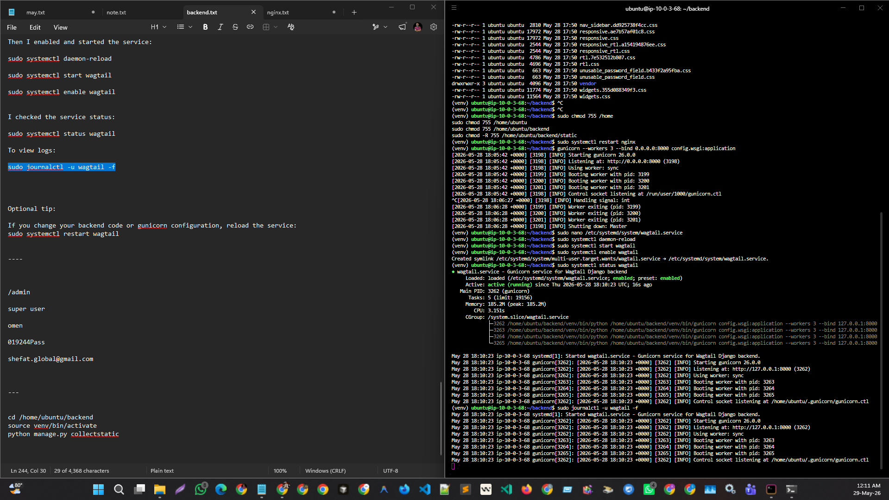

## Screenshot 3

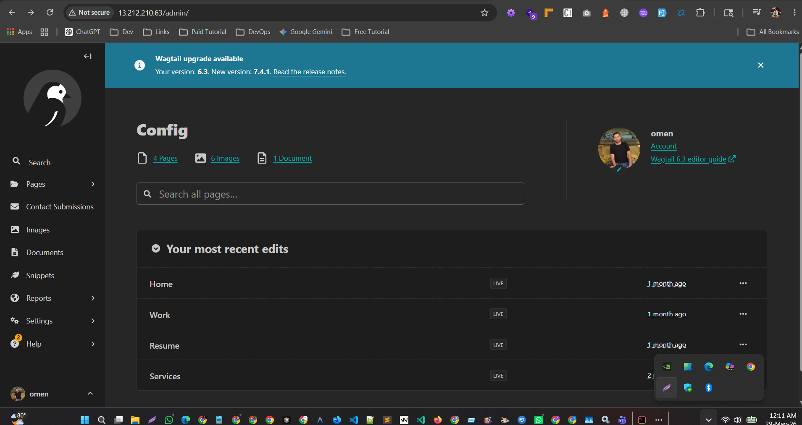

## Screenshot 4

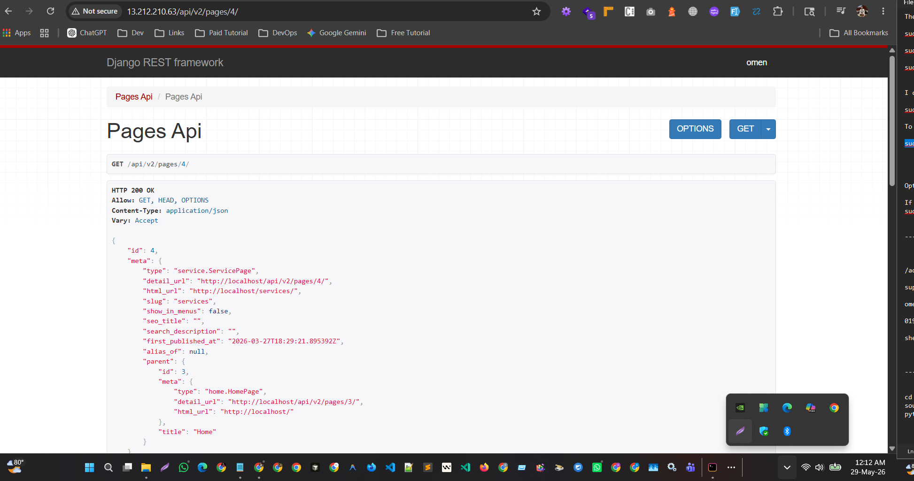

## Screenshot 5

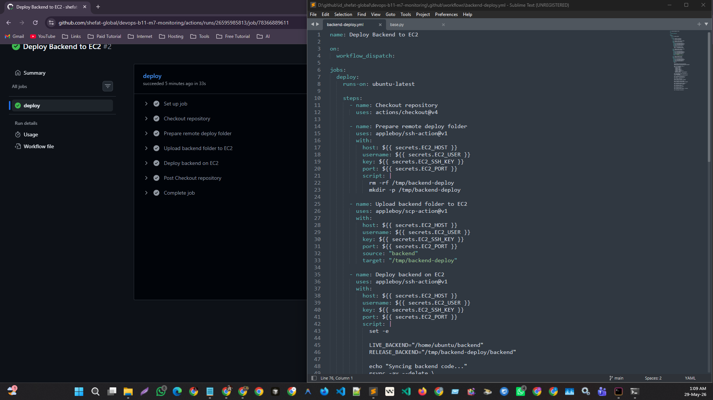

## Screenshot 6

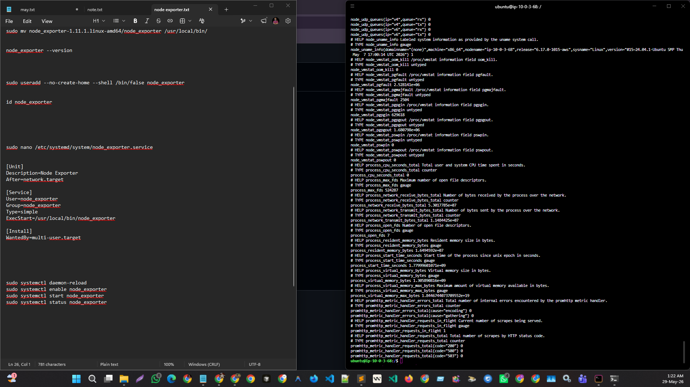

## Screenshot 7

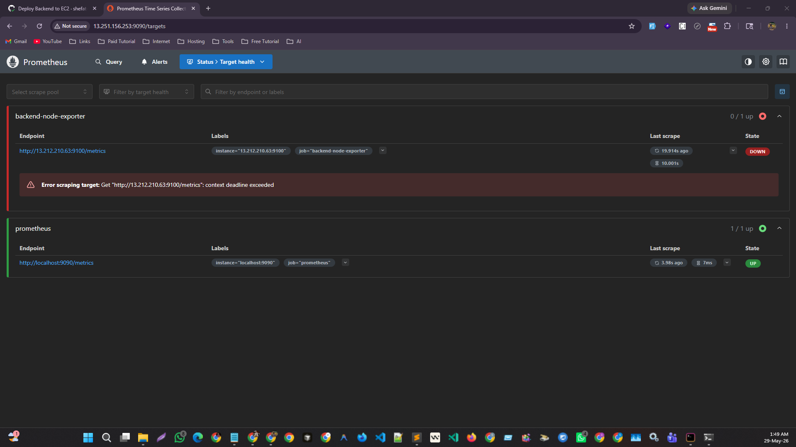

## Screenshot 8

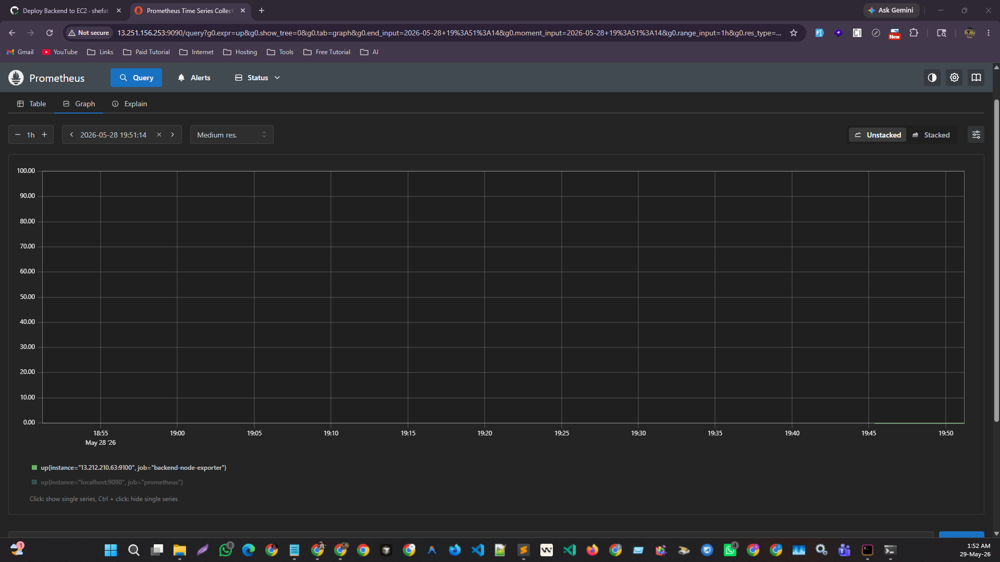

## Screenshot 9

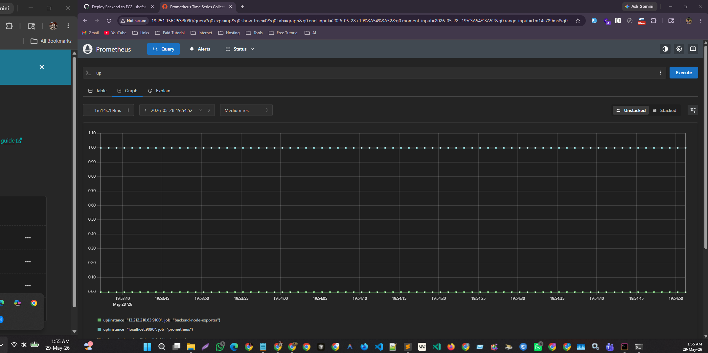

## Screenshot 10

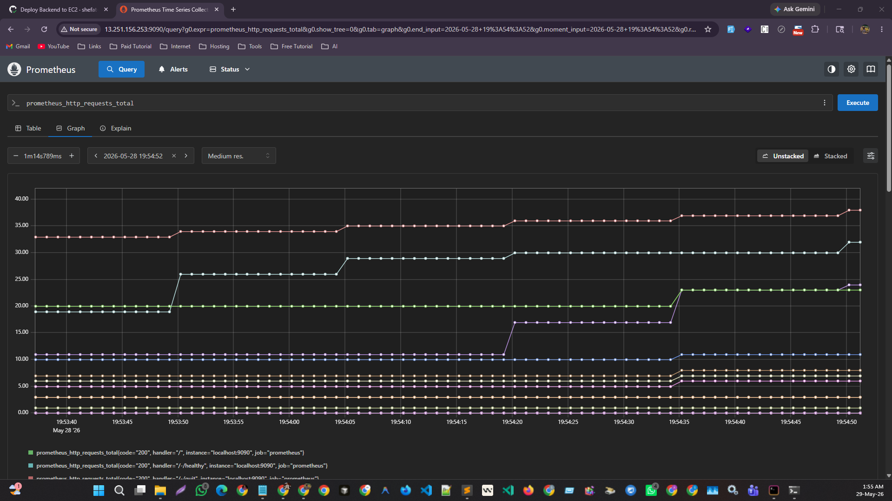

## Screenshot 11

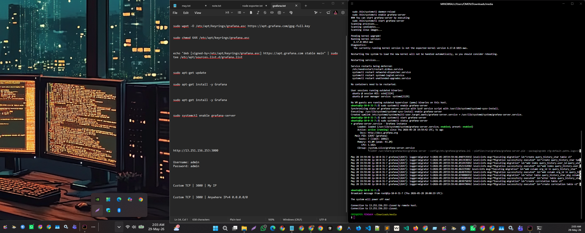

---

# Repository Screenshot Folder

All screenshots are stored in the following repository folder:

```text
screenshots/
```

These screenshots are included as proof of deployment, configuration, service status, monitoring setup, and final verification.
